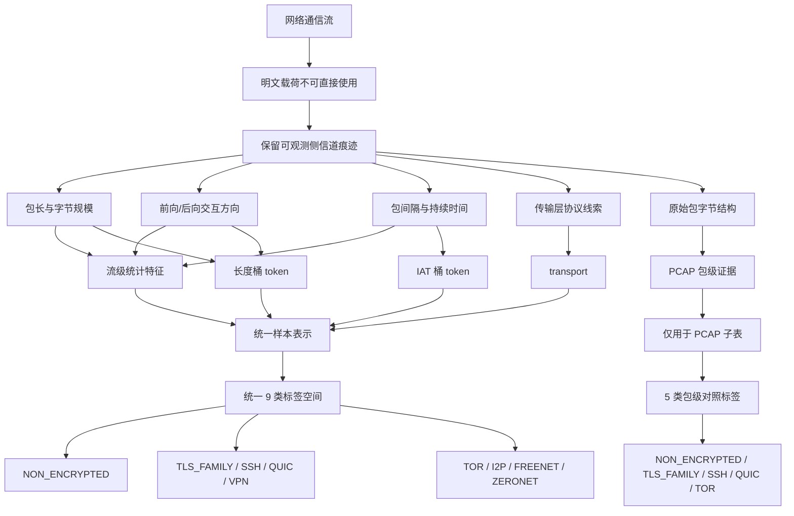
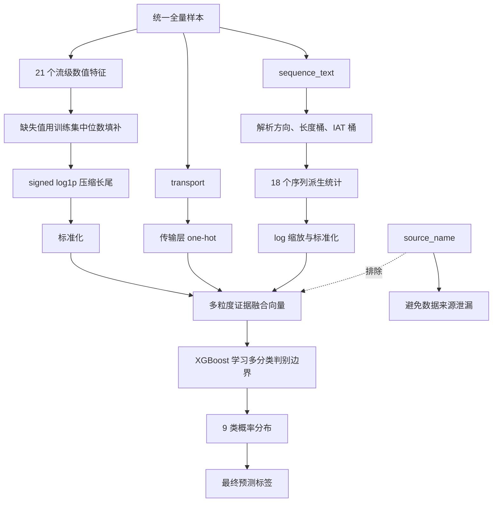
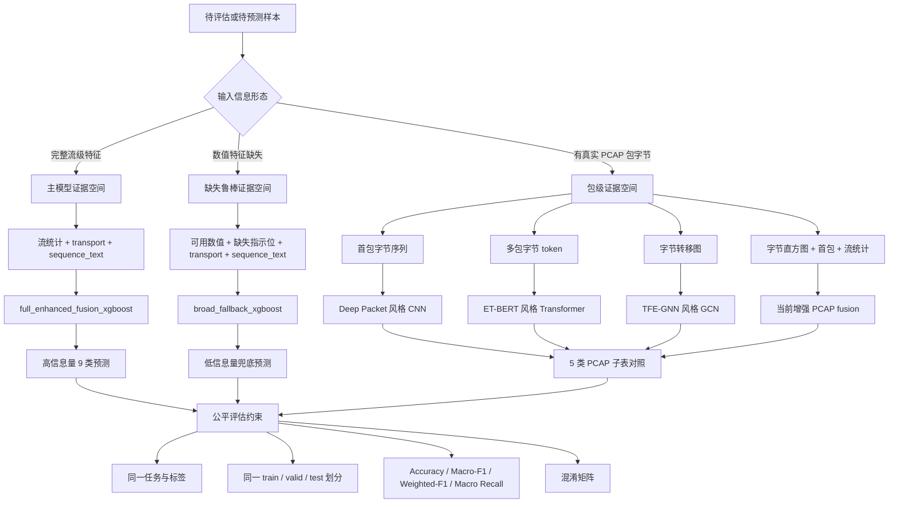

# 加密流量识别原理图

本文只描述当前项目的识别原理，不按工程模块、前后端、脚本调用关系绘制。
核心问题是：在看不到明文载荷的前提下，从流量留下的可观测侧信道痕迹中识别加密方法或匿名通信机制。

## 图 1：识别问题与证据来源

要点：项目不是解密流量，而是利用加密通信仍然暴露的包长、方向、时序、传输层和包字节形态来识别加密方法或匿名通信机制。全量主任务使用统一 9 类标签；需要原始包字节的方法只在 PCAP 子表中比较。

## 图 2：全量 9 类主方法融合判别原理

要点：主模型 `full_enhanced_fusion_xgboost` 的核心是把流统计、传输层和序列节奏三类证据压到同一个特征空间，再由 XGBoost 学习 9 类边界。`source_name` 被明确排除，避免模型记住数据来自哪里。

## 图 3：包级对照、低信息输入与公平评估边界

要点：完整输入走主模型；缺失输入走 fallback，并在结果中体现信息不足；需要原始包字节的论文方法只在 PCAP 子表比较。所有结果都必须在同一划分、同一标签和同一指标下解释，才能说明识别原理本身有效。

